##### **Autores:** [Rafael Mazariegos](https://github.com/rafael-m-r), Fernando López
{: .no_toc }
[ Marvin Chigüil](https://github.com/mrosendo782)

##### **Fecha de creación:** 05-06-2020
{: .no_toc }

##### **Revisiones:**  
{: .no_toc }

##### **Fecha de revisión:** 
{: .no_toc }

# ARP - Protocolo de resolución de direcciones
{: .no_toc }

#### Contenido:
{: .no_toc }

1. Propósito de ARP
1. Funcionamiento de ARP
1. Ejemplo de Entrega Directa
1. Ejemplo de Entrega a Través de un Router
1. Caché ARP
1. Formato de Frame ARP
1. ARP Gratuito

{:toc}

---

## Resumen
ARP (Address Resolution Protocolo) es un protocolo de comunicación que se encuentra en Link Layer (capa de datos). de una forma muy resumida este protocolo se encarga de asociar una dirección MAC que corresponde a una dirección IP. Se envía desde un dispositivo un "ARP request" hacia la dirección de broadcast (ff:ff:ff:ff:ff:ff), aquí se encuentra la dirección IP por la que se pregunta, la máquina asociada a esta IP realiza un "ARP reply". Cada máquina tiene un caché con las direcciones traducidas, esta tabla se tiene las direcciones MAC que se utilizan con más frecuencia. Este protocolo se puede utilizar cuando hay dos hosts en una misma red y uno quiere enviar paquetes hacia el otro, si hay dos hosts en diferentes redes se utiliza un router para llegar al otro. Un router puede necesitar enviar un paquete a un host a través de otro router o puede enviarlo desde la misma red.

## ARP
### Propósito de ARP
Cuando un host en una red va a enviar un paquete IP a cierto host con cierta dirección IP dentro de la red local,
primero necesita empaquetarlo dentro de una trama de link layer. Sin embargo, el host sólo conoce la IP del
dispositivo al que desea enviar el paquete, y no su **dirección física** (MAC). Por esta razón necesita una 
forma de obtener la MAC a partir de la IP del host de destino.
### Funcionamiento de ARP
El protocolo ARP utiliza consiste en los siguientes elementos básicos:

1. La **Tabla ARP**:\
Una tabla en el host que contiene todas las relaciones IP-MAC conocidas por el mismo. Los registros
antiguos de esta tabla son constantemente renovados o eliminados.

1. La **petición ARP**:\
Esta es enviada por un host si no conoce la MAC de una IP con la que se desea comunicar.
Entre los datos más importantes que contiene el mensaje están:
    * La **IP** del **origen**.
    * La **dirección física** del **origen**.
    * La dirección **IP** del dispositivo cuya dirección física se desea conocer.
    * Va dirigido a todos los dispositivos de la red local (FF:FF:FF:FF:FF:FF).

1. La **respuesta ARP**:\
Esta es enviada por el host que tiene la IP deseada. Entre los datos más importantes de este mensaje
están:
    * La **IP** del **origen**.
    * La **dirección física** del **origen**.
    * La **IP** del **destino**.
    * La **dirección física** del **destino** (la respuesta sólo va dirigida a quien envió la petición).
    
Básicamente, el protocolo sigue los siguientes pasos:

1. Un host A necesita enviar un mensaje a un host B, y conoce la IP de B. Sin embargo, necesita la dirección física
para encapsularlo.
1. El host revisa su tabla ARP, y si no tiene la IP y dirección física de B, envía una **petición ARP**.
1. Todos los hosts en la LAN reciben la **petición**, pero únicamente B contesta incluyendo su dirección física.
1. A recibe la **respuesta ARP**, y agrega el registro a su tabla ARP.
1. El host A encapsula su mensaje en un frame, y lo envía a B.

## Ejemplo de entrega directa
El siguiente es un ejemplo de protocolo ARP en una red local única:

1. El host A desea enviar un mensaje a B, pero no conoce su mac. Envía una petición ARP que llega a todos:
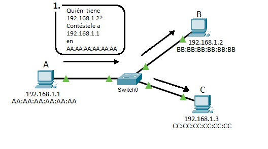
1. El host B le contesta directamente a A, incluyendo su dirección física:
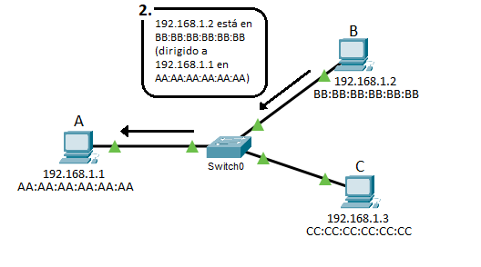
1. El host A envía el mensaje directamente a B, encapsulado en un frame con la dirección física del mismo:
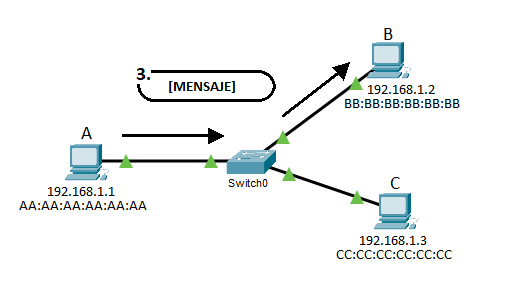
El registro de la IP y dirección física de B queda guardado en la tabla ARP de A.

## Ejemplo de entrega a través de un router
El ejemplo de entrega a través de un router es muy similar al ejemplo anterior, pero ocurre en dos redes locales
conectadas por un router:

**En la Red 1:**
1. A necesita enviar un mensaje a C, que está en otra red. Para esto, necesita enviar el mensaje a su Default Gateway.
Sin embargo, necesita encapsular el mensaje en un frame, y no conoce la dirección física de la Default Gateway. Por lo
tanto, envía una petición ARP, que es recibida por todos los hosts de la LAN.
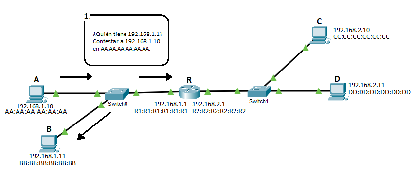
2. R contesta directamente a A, incluyendo su dirección física. 
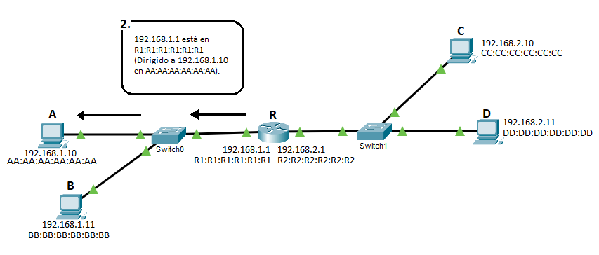
3. A envía el mensaje a R, encapsulado en un frame dirigido a la dirección física de R.
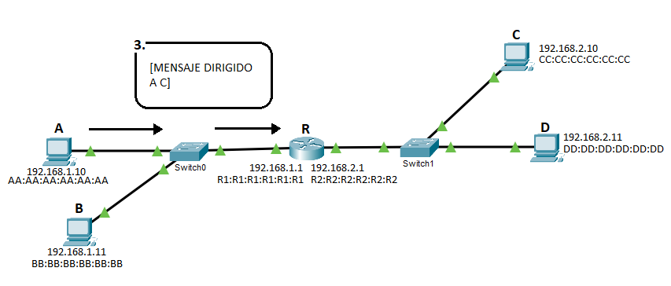

**En la Red 2:**
4. R necesita enviar el mensaje a C, pero no conoce su dirección física. Envía una petición ARP en la red local donde
está C. 
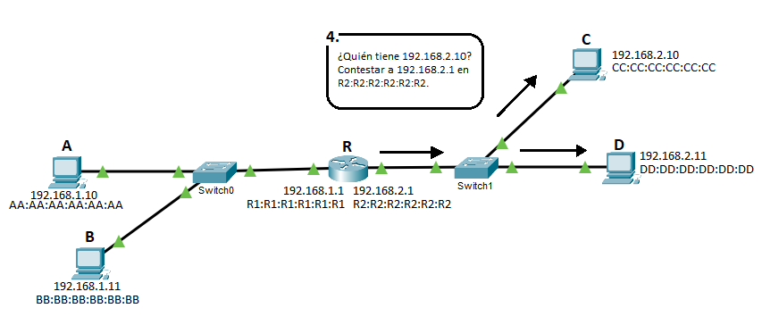
5. C responde directamente a R, incluyendo su dirección física.
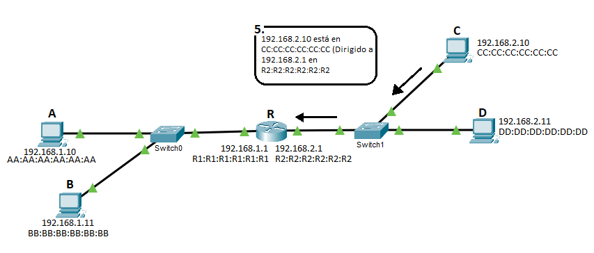
6. R encapsula el mensaje en un frame dirigido a la dirección física de C. C recibe el mensaje de A.
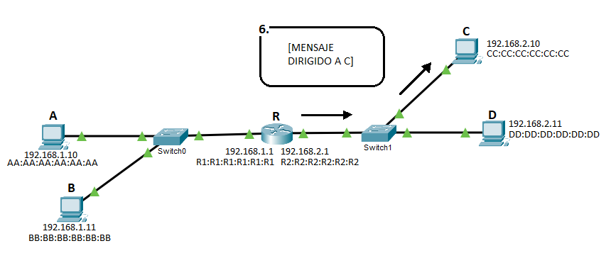

## Caché ARP
El caché ARP es una tabla que almacena las direcciones IP que corresponden a direcciones físicas de los dispositivos a los que ha enviado información recientemente y sirve para saber a que dirección MAC enviar la información para que esta llegue al destino deseado sin tener que enviar un ARP request cada vez que desea enviar información a otro dispositivo saturando la red. Estas pueden ser dinámicas (que se hacen automáticamente) o estáticas (que se agregan manualmente).

Para evitar errores, constantemente se revisa la edad de las entradas, y si llevan mucho tiempo, se eliminan de la tabla.
La duración de una entrada depende entre fabricantes de routers/otros hosts.

En Windows, se puede ver la tabla ARP con el comando:\
`arp -a`

En Cisco, se puede ver la tabla ARP con el comando:\
`show ip arp`

## Formato del frame ARP
El siguiente es el formato del frame ARP:

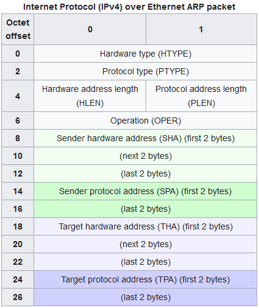

* **Protocol Type** especifica el protocolo de más alto nivel que se está usando (el que se esté usando encima de data link)
Para IPv4 el OpCode es 0x0800.
* **Operation** u **OpCode** indica el tipo de mensaje ARP: **1** es una **petición** y **2** es una **respuesta**.
* **Sender hardware address** es la dirección física del origen. Ocupa 48 bits, o 6 bytes.
* **Sender protocol address** es la dirección de protocolo superior que se esté usando. En caso de IPv4,
una dirección IP. Ocupa 32 bits o 4 bytes.
* **Target hardware address** es la dirección física del destino. Ocupa 48 bits, o 6 bytes.
* **Target protocol address** es la dirección de protocolo superior que se esté usando. En caso de IPv4, una dirección
IP. Ocupa 32 bits o 4 bytes.

## ARP Gratuito
El **Gratuitous ARP** es una forma de que un host envíe su información para ARP (su IP y su dirección física), sin que
otro host haya realizado una petición antes. De esta forma, un host hace que se actualicen las tablas ARP de otros en
su red (usa ff:ff:ff:ff:ff:ff).

Es especialmente útil cuando hay fallos o cambios de configuración en una red, y es necesario notificar a los hosts
en la misma.

El mensaje de Gratuitous ARP tiene el mismo OpCode y Formato que un mensaje de petición (1), y va dirigido a todos
los hosts.

## Preguntas

### Pregunta 1
##### Qué diferencias hay entre un mensaje ARP de petición y uno de Respuesta?

### Pregunta 2
##### En la siguiente red, si las tablas ARP de todos los dispositivos están vacías, y PC5 envía un mensaje ICMP a PC6, cuántos mensajes ARP se van a enviar en total durante el transcurso del envío (desde que PC5 busca en su tabla vacía hasta que PC6 reciba el mensaje)?
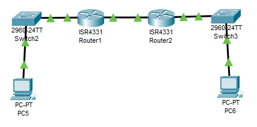